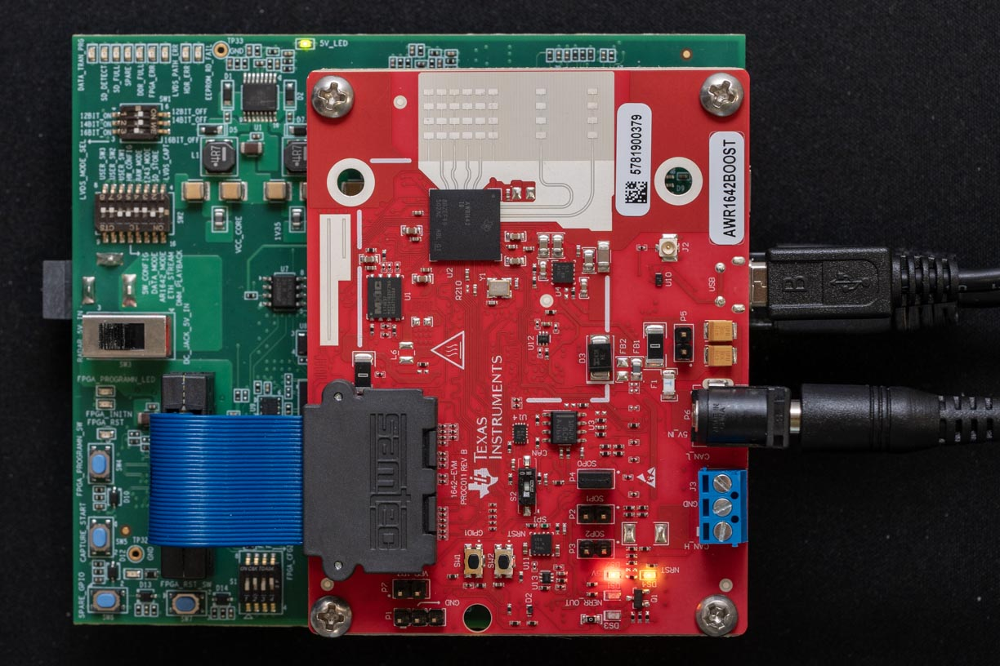
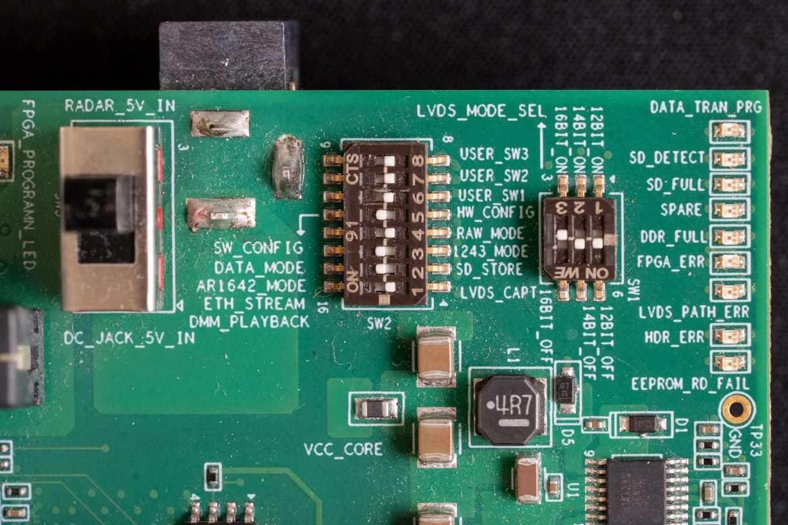
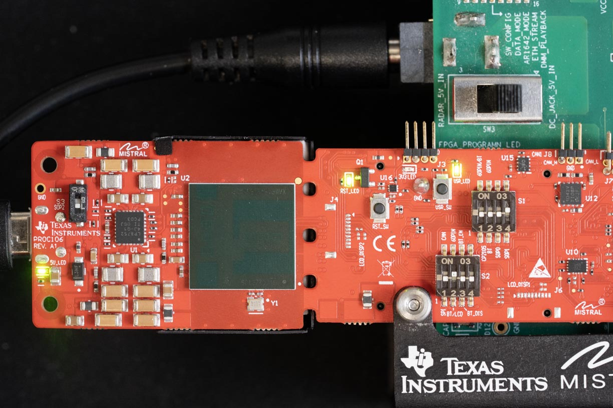

# `xwr`: Linux-Based Real-Time Raw Data Capture for TI mmWave Radars

{: style="width: 32%"}
{: style="width: 32%"}
{: style="width: 32%"}

## Setup

The `xwr` library is currently only distributed via github:

=== "Direct Install"

    ```sh
    # Install directly from github
    pip install git+ssh://github.com/WiseLabCMU/xwr.git
    ```

=== "Integrated Development"

    ```sh
    git clone git@github.com:WiseLabCMU/xwr.git
    pip install -e ./xwr
    ```

=== "Standalone Development"

    ```sh
    git clone git@github.com:WiseLabCMU/xwr.git
    cd xwr; uv sync --all-extras
    ```

=== "Using `uv` and `pyproject.toml`"

    ```toml
    [project]
    dependencies = ["xwr"]

    [tool.uv.sources]
    xwr = { git = "ssh://git@github.com/WiseLabCMU/xwr.git" }
    ```

You will also need to [configure the radar and capture card](setup.md) for raw data capture.

!!! info "Supported Devices"

    <div class="grid cards" markdown>

    - [:material-arrow-right: DCA1000EVM Capture Card](https://www.ti.com/tool/DCA1000EVM)
    - [:material-arrow-right: AWR1843Boost](https://www.ti.com/tool/AWR1843BOOST)
    - [:material-arrow-right: AWR1843AOPEVM](https://www.ti.com/tool/AWR1843AOPEVM)
    - [:material-arrow-right: AWR1642](https://www.ti.com/tool/AWR1642BOOST)
    - :construction_site: WIP: AWR2544LOPEVM

    </div>

## Usage

The high-level API is mostly stable:

```python
import logging
import yaml
import xwr

logging.basicConfig(level=logging.DEBUG)

with open("config.yaml") as f:
    cfg = yaml.safe_load(f)

awr = xwr.XWRSystem(**cfg, type="AWR1843")
for frame in awr.stream():
    break

awr.stop()
```

See the [high level API documentation](system.md) for detailed documentation.


## Troubleshooting

!!! success "Initialization Delay"

    While the radar is booting, you will not be able to open the serial port.
    ```
    [Errno 16] Device or resource busy: '/dev/ttyACM0'
    ```
    This is normal, and should go away after ~10-30 seconds.

**Dead FPGA**: When powered on, the capture card error lights should all come on for ~1sec, then turn off again. If this does not occur, the FPGA may be dead.

**Device Times Out**: This can also be caused by a loose LVDS cable (the blue ribbon cable between the radar and capture card), if the pins corresponding to commands are loose.

**Other Hardware Faults**: The [TI mmWave Demo Visualizer](https://dev.ti.com/gallery/view/mmwave/mmWave_Demo_Visualizer/ver/3.6.0/) is a good way to validate radar hardware functionality, and uses the same demo firmware.

!!! note

    If an error is returned on the console in the Demo Visualizer: there may be a hardware fault. It should be raised with a line number in `mss_main.c`; the error case (e.g. `RL_RF_AE_CPUFAULT_SB`) should reveal what general type of fault it is.

## See Also

<div class="grid cards" markdown>

- :material-golf-cart: [`red-rover`](https://wiselabcmu.github.io/red-rover/)

    ---

    a multimodal mmWave Radar spectrum ecosystem

- :material-cube-outline: [`abstract_dataloader`](https://wiselabcmu.github.io/abstract-dataloader/)

    ---

    abstract interface for composable dataloaders and preprocessing pipelines

</div>
